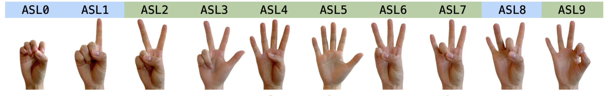
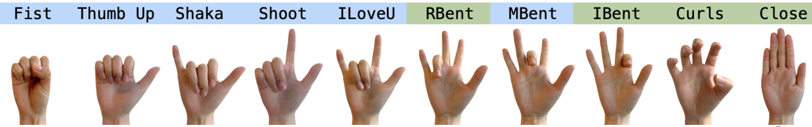

# WristPose
## 手势设计

（待设计）

## 数据采集

一个session为：
20个手势每个重复10次，一共200次，全部随机顺序。然后进行个随机手势。一共230个手势。

每个采集者进行3个session，每个session之间休息1分钟，并且重新摘下并戴上手环。

预计采集20个人数据，一共60个session，13800个手势。

每次采集在界面上显示应该进行的手势，并倒计时2s，计时结束后显示新的手势。